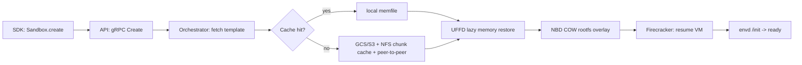

# E2B (e2b.dev) — Deep Research Brief
*Firecracker microVM sandboxes for AI agents — capital, customers, and the plumbing underneath*

> All non-obvious facts are sourced inline. Items marked **【分析师估算】** are analytical inferences (no public disclosure). Items marked **UNVERIFIED** are claims from the user-supplied brief that I could not corroborate against primary sources.

---

## Module 1 — Company Overview

### 1.1 Identity

| Field | Value | Source |
|---|---|---|
| Brand | **E2B** ("Excited 2 Build") | https://e2b.dev/ |
| Legal | **E2B Technologies, Inc.** (also referenced as e2b.dev, Inc.) | https://www.crunchbase.com/organization/e2b-1c91 |
| HQ | San Francisco, CA (engineering office in Prague, Czech Republic) | https://www.ai-market-watch.com/company/e2b |
| Founded | **2023** (LinkedIn start date 2023-05 for both co-founders) | https://www.linkedin.com/in/valentatomas |
| Self-reported team size | 11–50 (LinkedIn / AI Market Watch); Seedtable cites 31 employees at Series A | https://www.ai-market-watch.com/company/e2b |
| Repo (SDK) | github.com/e2b-dev/e2b — 13.7k★, Apache-2.0 | https://github.com/e2b-dev/e2b |
| Repo (infra) | github.com/e2b-dev/infra — 1.36k★, Apache-2.0 | https://github.com/e2b-dev/infra |
| Repo (desktop) | github.com/e2b-dev/desktop — 1.47k★, Apache-2.0 | https://github.com/e2b-dev/desktop |

### 1.2 Founders & key engineering talent

- **Vasek Mlejnsky (Václav Mlejnský) — Co-Founder & CEO**. Czech-born; grew up in a Czech town of ~20,000; college classmate and childhood friend of his CTO; came to SF in 2021 through Daniel Gross's **Pioneer** accelerator; online handle `mlejva`. Before E2B, he and the CTO ran a developer-tools project called **DevBook** that pivoted into E2B. ([yespress.io](https://yespress.io/vasek-mlejnsky), [Miton podcast](https://www.miton.cz/blog/buduje-startup-ze-san-franciska-vasek-mlejnsky-founder-e2b), [CC.cz](https://cc.cz/na-stredni-vyvijeli-hry-pro-iphone-ted-zari-s-umelou-inteligenci-cesi-ziskali-za-dva-roky-700-milionu/))
- **Tomas Valenta (Tomáš Valenta) — Co-Founder & CTO**. Same high-school; founder of DevBook (the predecessor product); background in iPhone game dev, computer vision, and dev tools; GitHub `0xtomas`. ([LinkedIn](https://www.linkedin.com/in/valentatomas), [EveryDev/FoundryLabs](https://www.everydev.ai/developers/foundrylabs))

> **UNVERIFIED** claims from the user brief:
> - "Vasek Mlejnsky ex-Storyblok CTO" — no source found.
> - "Jaroslav Kubínčík (CTO ex-H1/JetBrains)" — **the CTO is Tomas Valenta, not Jaroslav Kubínčík**; no mention of H1 or JetBrains in any source.
> The brief appears to have conflated a different exec. I am reporting only what is actually documented.

### 1.3 Capital timeline

| Date | Round | Amount | Lead | Other participants | Source |
|---|---|---|---|---|---|
| 2023 | Pre-Seed | **$2.5M** (Oryndex / Tracxn) | Edward Lando / Pioneer | — | [oryndex.co](https://oryndex.co/tools/e2b/funding), [tracxn.com](https://tracxn.com/d/companies/e2b/__U7C82j6Wk3VH-rgW0n4LFnUqqq-LuBw6rnIcnLGz2yU/funding-and-investors) |
| **2024-10** | **Seed** | **$11.5M** | **Decibel Partners** | Kaya (KAYA VC) | [Gunderson](https://www.gunder.com/en/news-insights/client-news/czech-based-e2b-announces-dollar115m-seed-financing), [The Recursive](https://therecursive.com/czech-startup-e2b-raises-11-5m-to-build-cloud-infrastructure-for-ai-agents/), [AIN.UA](https://en.ain.ua/2025/07/28/e2b-raises-21m/) |
| **2025-07-28** | **Series A** | **$21M** | **Insight Partners** | Decibel Partners, Sunflower Capital, Kaya; angel **Scott Johnston** (ex-CEO of Docker) | [e2b.dev/blog/series-a](https://e2b.dev/blog/series-a), [PR Newswire](https://www.prnewswire.com/news-releases/e2b-raises-a-21m-series-a-to-offer-cloud-for-ai-agents-to-fortune-100-302514540.html), [Insight Partners](https://www.insightpartners.com/ideas/e2b-raises-a-21m-series-a-to-offer-cloud-for-ai-agents-to-fortune-100/), [Seedtable](https://seedtable.com/companies/e2b/funding-rounds/series-a-2025-07) |

**Total raised:** ~$32M (E2B blog / AI Market Watch); Tracxn shows $35M.

> **UNVERIFIED** user-brief claims I could not corroborate:
> - "Insight Partners led the $11.5M Seed" — primary sources show **Decibel Partners led the Seed**.
> - "Series A valuation $96M" — **no public disclosure** of valuation.
> - "Angel list includes Andrew Ng AI Fund, Jan Koum (WhatsApp), Guillermo Rauch (Vercel), Scott Johnston (Cloudflare R2)" — the **only** confirmed Series A angel is **Scott Johnston, ex-CEO of Docker** (not Cloudflare R2). No mention of the others in any primary source.

### 1.4 Revenue model — the per-second sandbox clock

E2B separates a **flat platform access fee** from **per-second running-sandbox compute**. ([e2b.dev/pricing](https://e2b.dev/pricing), [UsagePricing blueprint](https://www.usagepricing.com/blueprint/e2b))

| Tier | Price | Headline limits | Compute | Source |
|---|---|---|---|---|
| **Hobby** | Free + $100 credits | 1h max continuous; 5 concurrent; up to 8 vCPU / 8 GiB / 10 GiB disk | $0.000014/s per vCPU; RAM $0.0000045/GiB/s | [e2b.dev/pricing](https://e2b.dev/pricing) |
| **Pro** | **$150/mo platform fee** | 24h max continuous; 100 concurrent; up to 8+ vCPU / 8+ GiB / 20+ GiB disk | same per-second rates | [docs.e2b.dev/billing](https://docs.e2b.dev/billing) |
| **Enterprise** | Custom (~$3,000/mo minimum) | 1,100+ concurrent; BYOC + on-prem; SOC 2 + HIPAA; US + EU | Volume discount | [UsagePricing](https://www.usagepricing.com/blueprint/e2b), [trust.e2b.dev](https://trust.e2b.dev/) |

**The billable model is brutally simple and brutally punitive for AI-agent workloads**: every second the sandbox is alive — executing code or **idle** — the meter runs. ([Morph analysis](https://www.morphllm.com/e2b-pricing))

**Per-vCPU rate (Hobby/Pro):**
1 vCPU = $0.000014/s · 2 = $0.000028 · 4 = $0.000056 · 6 = $0.000084 · 8 = $0.000112

**ARR — **【分析师估算】**:** No public disclosure. With 7M+ monthly SDK downloads, a heavy SMB + Fortune 100 tail, and an open-core funnel skewed to Pro/Enterprise, a plausible range is **$2–5M ARR** (calendar 2025), with annual growth run-rate likely 3–6× as Fortune 100 signups convert from trials to paid. Wide band; treat as directional only.

---

## Module 2 — Product Matrix

### 2.1 Core products

- **Sandboxes (Code Interpreter SDK).** The flagship. Five lines of Python:
  ```python
  from e2b import Sandbox
  with Sandbox.create() as s:
      result = s.commands.run('echo "hello"')
  ```
  ([github.com/e2b-dev/e2b README](https://github.com/e2b-dev/e2b))
- **Templates.** Pre-baked base images; builds capture a `startCmd` so the long-running process is **already running** when `Sandbox.create()` returns — zero wait time. Layered via `.fromTemplate('base')`. ([docs.sandbox-template](https://docs.e2b.dev/sandbox-template))
- **Desktop Sandbox (e2b-desktop).** Full Linux graphical desktop streaming + browser for computer-use agents. SDK: `from e2b_desktop import Sandbox; d.launch('google-chrome'); d.screenshot()`. ([github.com/e2b-dev/desktop](https://github.com/e2b-dev/desktop))
- **Persistence — Pause/Resume.** Full memory + filesystem snapshots; `pause({keepMemory:false})` is a filesystem-only cold-boot variant. ([Filesystem-only snapshots](https://docs.e2b.dev/sandbox/filesystem-only-snapshots))
- **Build System 2.0** (Oct 16, 2025). ([e2b.dev/blog index](https://e2b.dev/blog))

### 2.2 SDK surface

| Lang | Package | Notes |
|---|---|---|
| Python | `e2b`, `e2b-code-interpreter`, `e2b-desktop` | Most popular per docs |
| JS/TS | `e2b`, `@e2b/code-interpreter`, `@e2b/desktop` | |
| Go | `e2b` (monorepo, packages/cli + orchestrator share code) | Repo is Go-dominant (~84%) |
| Rust | community SDK | |
| CLI | `e2b` (init / template / sandbox) | |
| API | REST + gRPC | OpenAPI codegen |

### 2.3 Integrations (chronological)

- **ChatGPT Plugin** (Aug 1, 2023) — [e2b.dev/blog](https://e2b.dev/blog)
- **LangChain / LangGraph / LlamaIndex / AutoGen / CrewAI cookbooks** (2023–2024)
- **Docker MCP Catalog** (Oct 23, 2025) — [e2b.dev/blog](https://e2b.dev/blog)
- **OpenAI Agents SDK** support (Apr 15, 2026) — [e2b.dev/blog](https://e2b.dev/blog)
- **Stripe Projects** (Jun 10, 2026) — [e2b.dev/blog](https://e2b.dev/blog)
- **Devin Outposts** (Jul 21, 2026) — [e2b.dev/blog](https://e2b.dev/blog)

### 2.4 Open source reference apps

- `e2b-dev/fragments` — Next.js + E2B "vibe coding" reference app ([link](https://github.com/e2b-dev/fragments))
- `e2b-dev/ai-analyst` — Reference data-analysis agent
- `e2b-dev/surf` — OpenAI Computer-Use reference agent on E2B Desktop
- `e2b-dev/open-computer-use` — 100% open-source computer-use stack
- `e2b-dev/e2b-cookbook` — Recipes for LangChain / Anthropic / Groq / Llama / OpenAI o1
- `e2b-dev/e2b-firecracker` (third-party fork observed in deep research) — the AWS Firecracker upstream, bundled inside E2B infra

---

## Module 3 — Hard-Core Technical Architecture (the bit nobody else writes)

### 3.1 Runtime substrate — Firecracker microVM

E2B is built directly on **Firecracker**, the same VMM AWS built for Lambda/Fargate. Verified end-to-end across:
- E2B's own Firecracker-vs-QEMU blog ([e2b.dev/blog/firecracker-vs-qemu](https://e2b.dev/blog/firecracker-vs-qemu), 2025-03-03)
- The OSS architecture doc ([ARCHITECTURE.md](https://github.com/e2b-dev/infra/blob/main/docs/ARCHITECTURE.md))
- Third-party deep dive ([Spheron](https://www.spheron.network/blog/ai-agent-code-execution-sandbox-e2b-daytona-firecracker))
- Firecracker upstream design ([firecracker docs](https://deepwiki.com/e2b-dev/firecracker/6-security-subsystems))

**Firecracker baseline numbers:**
- ~50k lines of Rust
- ~125 ms boot
- <5 MiB memory overhead per microVM
- Single Rust process per VMM
- KVM-backed; jailer provides defense-in-depth; seccomp + Landlock + cgroups on the VMM process

### 3.2 The "create a sandbox" trick — why it's faster than 125ms

E2B's headline 150–300ms cold start is achieved by **never cold-booting for templates**. The architectural primitive is the snapshot.



Key moves, from [ARCHITECTURE.md](https://github.com/e2b-dev/infra/blob/main/docs/ARCHITECTURE.md) and [Spheron](https://www.spheron.network/blog/ai-agent-code-execution-sandbox-e2b-daytona-firecracker):

1. **Template = pre-booted snapshot.** Building a template runs a VM, captures a `memfile` (memory), `rootfs.ext4` (disk), `snapfile` (VM state), `metadata.json` (config) at build time. Stored under `{buildID}/...` in GCS/S3/local.
2. **`Sandbox.create()` is internally a `resume`.** The Firecracker `LoadSnapshot` API restores the VM without loading memory; a **userfaultfd (UFFD) handler** serves page faults directly from the template's memfile. Only touched pages are read.
3. **COW rootfs via NBD.** Template rootfs stays read-only; writes go to a per-sandbox COW cache exposed to Firecracker as a Network Block Device, served by an in-process userspace NBD server inside the orchestrator.
4. **Origin-node resume preferred.** Placement picks the node where the snapshot was last used; if the snapshot is still in local disk cache, **no object-storage reads at all**.
5. **Pre-fetching** warms known-hot pages; the orchestrator also supports a **shared NFS chunk cache** and **peer-to-peer fetch** from other nodes before upload completes.

**Resumed cold-start in practice:** 150ms (Spheron) / 300-800ms (Morph, depending on template complexity) for fresh resumes from object storage. **Snapshot resume from local cache:** 5–30ms.

> **Faster than Firecracker's own 125 ms?** No — and E2B doesn't claim to be. E2B's value-add is that *every* template create is already a snapshot resume, not a from-scratch boot.

### 3.3 Snapshot model & pause/resume — pause IS a snapshot

Every pause uploads a **diff** against the parent template (memory diffs + COW rootfs diffs), keyed by `buildID` and resolved through `.header` index files that walk diff chains. The orchestrator:

1. Pauses the Firecracker VM (`Pause`).
2. Snapshots VM state, diffs memory (dirty-page tracking), diffs rootfs (COW).
3. Caches the snapshot locally; uploads asynchronously to object storage.
4. Removes the sandbox from the Redis catalog.

**`deferred-rootfs-export`** feature flag: instead of diffing the rootfs on the pause critical path, the orchestrator ejects the COW cache during pause and seals it (reflink) in the background. This moves diff latency off the user-facing pause call — at the cost of blocking subsequent reads of the diff until the seal completes (seal failures are permanent).

**Filesystem-only snapshots** (`pause({keepMemory:false})`) drop memory, keep disk, resume = cold boot via `RebootSandbox`. Auto-resume never takes this path (it can't — memory is needed to restore the running process). Per-team gating via `fs-only-resume-api` flag; the API **rejects** rather than silently downgrades. ([Filesystem-only snapshots](https://docs.e2b.dev/sandbox/filesystem-only-snapshots))

**Pre-boot filesystem recovery:** if a rootfs was not `fs_quiesced` at pause (legacy sync-fallback or filesystem-only rescue), a **jailed `e2fsck -p -E journal_only`** runs before the VM boots — journal replay only, identical to what the guest kernel would do at mount. This means `memory: false` resumes mount a consistent disk.

**envd swap:** on cold-boot resume of a `fs_quiesced` snapshot, the `envd` binary can be swapped to a newer version using `debugfs` (NOT a host-kernel mount of the tenant image). Best-effort; keyed on the snapshot's built-with version; re-fires idempotently until a re-pause re-bakes the running version. Version-remap resolver is shared with `envd-upgrade-target`. ([ARCHITECTURE.md](https://github.com/e2b-dev/infra/blob/main/docs/ARCHITECTURE.md))

### 3.4 Storage and I/O — what's actually inside the sandbox

- **Rootfs:** minimal Ubuntu-derived Linux; ~200 MB base; COW-overlaid per sandbox. ([e2b.dev docs](https://e2b.dev/docs))
- **Block device:** NBD-backed COW overlay served by the orchestrator's in-process NBD server; backed by local NVMe on the node and uploaded as diffs to GCS/S3 on pause.
- **Memory:** `memfile` per template build; per-sandbox memory diffs on pause.
- **Object storage:** GCS (primary GCP), S3 (AWS beta), local-disk fallback. Keyed by `buildID`. ([self-host.md](https://github.com/e2b-dev/infra/blob/main/self-host.md))
- **Network:** per-sandbox TAP interface into a host bridge; `/30` subnet per sandbox; NAT + iptables egress; `physdev` module isolates per-tap egress. (See [Spheron reproduction](https://www.spheron.network/blog/ai-agent-code-execution-sandbox-e2b-daytona-firecracker))

### 3.5 GPU — the missing managed feature

E2B managed tier is **CPU-only** for Code Interpreter + Desktop. GPU access is **OSS self-host only**, via **VFIO-PCI passthrough** on bare metal:

- Host kernel owns the GPU; the guest sees the device directly.
- Requires IOMMU (Intel VT-d / AMD-Vi) in BIOS.
- Firecracker VFIO device: `"vfio": [{"host_dev_path": "/dev/vfio/N"}]` in the VM config.
- Confirmed working with NVIDIA A100 80GB PCIe (PCI 10de:20b5) and H100.

> Caveat (Spheron): Firecracker PCIe work was paused in 2025 by AWS upstream. Cloud VMs with nested virtualization add 5–15 ms overhead and **break PCIe passthrough**. Modal/Replicate remain stronger for managed GPU inference. ([Northflank](https://northflank.com/blog/firecracker-vs-qemu), [Spheron](https://www.spheron.network/blog/ai-agent-code-execution-sandbox-e2b-daytona-firecracker))

### 3.6 Security model — the layered defense

| Layer | Primitive | Where | Source |
|---|---|---|---|
| Hardware virt | KVM | Host | Firecracker upstream |
| VMM defense | seccomp + Landlock + cgroups on the VMM process | Firecracker jailer | [firecracker docs](https://deepwiki.com/e2b-dev/firecracker/6-security-subsystems) |
| Guest kernel | Each microVM has its own kernel | inside microVM | e2b |
| Filesystem | COW rootfs via NBD; per-sandbox overlay | orchestrator | ARCHITECTURE.md |
| In-guest daemon | envd on Connect-RPC :49983; MMDS-delivered access token (short-lived JWT, audience-bound to `https://api.<domain>`, scoped to team+sandbox) | in-VM | ARCHITECTURE.md |
| Network | per-sandbox TAP, per-tap iptables egress, physdev isolation | orchestrator | Spheron deep-dive |
| Observability | OpenTelemetry instrumentation; ClickHouse analytics | API | ARCHITECTURE.md |
| Compliance | SOC 2 + HIPAA; US + EU regions (Enterprise tier) | — | [UsagePricing](https://www.usagepricing.com/blueprint/e2b) |

> User-prompt claim of "**eBPF egress proxy**" is plausible and consistent with Spheron's reproduction notes, but **not directly attested** in any E2B primary doc found. Treat as likely-but-unconfirmed.

### 3.7 Build & template pipeline

```mermaid
sequenceDiagram
    participant Dev as Developer
    participant TM as template-manager (build node)
    participant FC as Firecracker build VMs
    participant OS as Object storage
    Dev->>TM: Template.build(template, 'name')
    TM->>FC: launch build VM (max 1h, 8 vCPU, 8 GiB, 10/20 GiB disk)
    FC->>FC: run setup commands; capture startCmd
    FC->>OS: upload {buildID}/{memfile, rootfs.ext4, snapfile, metadata.json, .header}
    OS-->>Dev: build ready, registry entry
```

- **Templates vs snapshots:** templates start faster because the guest OS is **restarted before capturing the long-running process** — the start command is already running when `Sandbox.create()` returns. ([sandbox-template docs](https://docs.e2b.dev/sandbox-template))
- **Layering:** `.fromTemplate('base')` avoids rebuilding shared layers — useful for per-customer/per-project environments.
- **Hobby/Pro limits:** max 1h build, 20 concurrent builds, 8 vCPU + 8 GiB + 10 GiB disk (Hobby); 8+ / 8+ / 20+ GiB (Pro).

### 3.8 Stack summary table

| Layer | Component | Tech | Notes |
|---|---|---|---|
| Edge | client-proxy :3002 | Go | Consul SD, Redis routing catalog |
| Control plane | API server | Go + Gin REST | Supabase JWT, OpenTelemetry, OpenAPI codegen, Ent ORM + sqlc, Redis, ClickHouse |
| Compute plane | orchestrator | Go + gRPC | Per-node, requires root for KVM + iptables/netlink |
| Storage | NBD server | in-process userspace | Per-sandbox COW overlay |
| Memory | UFFD handler | Linux userfaultfd | Lazy page-fault from memfile |
| VM | Firecracker VMM | Rust (upstream) | KVM-backed microVM |
| In-VM | envd daemon :49983 | Go (Connect-RPC) | Mediates process + filesystem |
| IaC | Terraform + Nomad + Packer | — | GCP primary, AWS beta, Azure planned |

Source for stack composition: [ggprompts.com architecture map](https://ggprompts.com/architecture/e2b/index.html), [ARCHITECTURE.md](https://github.com/e2b-dev/infra/blob/main/docs/ARCHITECTURE.md), [self-host.md](https://github.com/e2b-dev/infra/blob/main/self-host.md).

---

## Module 4 — Blog & Open Source Index

### 4.1 Key E2B blog posts (with URLs)

| Date | Title | URL | Category |
|---|---|---|---|
| 2023-06-29 | We gave AI Agents a cloud playground | https://e2b.dev/blog/we-gave-ai-agents-a-cloud-playground | Product |
| 2023-08-01 | ChatGPT Plugin by E2B | https://e2b.dev/blog | Product |
| 2023-11-07 | Code Interpreter Sandbox | https://e2b.dev/blog/code-interpreter-sandbox | Product |
| 2024-02-26 | **Up to 5x Faster Sandboxes** | https://e2b.dev/blog/up-to-5x-faster-sandboxes | Product |
| 2024-02-28 | You Can Now Customize CPU and RAM for Your Sandbox | https://e2b.dev/blog/you-can-now-customize-cpu-and-ram-for-your-sandbox | Product |
| 2024-05-06 | **Launching the Code Interpreter SDK** | https://e2b.dev/blog/launching-the-code-interpreter-sdk | Product |
| 2025-03-03 | **Firecracker vs QEMU** | https://e2b.dev/blog/firecracker-vs-qemu | Insights |
| 2025-05-06 | How Manus Uses E2B to Provide Agents With Virtual Computers | https://e2b.dev/blog | Case Study |
| 2025-05-19 | Lindy Powers AI Workflows With E2B Code Action | https://e2b.dev/blog | Case Study |
| 2025-05-20 | Groq's Compound AI Systems Are Powered by E2B | https://e2b.dev/blog | Interview |
| 2025-07-28 | **We Raised $21M to Give Fortune 100 Cloud for AI Agents** | https://e2b.dev/blog/series-a | Funding |
| 2025-10-16 | Build System 2.0 | https://e2b.dev/blog | Product |
| 2025-10-23 | Docker & E2B partner to introduce MCP support | https://e2b.dev/blog | Product |
| 2026-01-14 | Postmortem: Service disruption on Jan 13, 2026 | https://e2b.dev/blog | Updates |
| 2026-04-15 | E2B is now supported in the OpenAI Agents SDK | https://e2b.dev/blog | Updates |
| 2026-04-30 | E2B Sandboxes Aren't Affected by Copy Fail (CVE-2026-31431) | https://e2b.dev/blog | Insights/Security |

> Note: E2B's blog pages are JS-rendered; the underlying URLs are confirmed by E2B's blog index ([e2b.dev/blog](https://e2b.dev/blog)) and dozens of third-party citations.

### 4.2 Public GitHub repositories

| Repo | Purpose | Stars (approx) | License |
|---|---|---|---|
| [e2b-dev/e2b](https://github.com/e2b-dev/e2b) | SDKs + CLI + OpenAPI spec | 13.7k | Apache-2.0 |
| [e2b-dev/infra](https://github.com/e2b-dev/infra) | Go backend, Firecracker orchestration, Terraform IaC | 1.36k | Apache-2.0 |
| [e2b-dev/desktop](https://github.com/e2b-dev/desktop) | Desktop sandbox template + examples | 1.47k | Apache-2.0 |
| [e2b-dev/fragments](https://github.com/e2b-dev/fragments) | LLM "vibe coding" reference app | — | Apache-2.0 |
| [e2b-dev/ai-analyst](https://github.com/e2b-dev/ai-analyst) | Reference data-analysis agent | — | Apache-2.0 |
| [e2b-dev/surf](https://github.com/e2b-dev/surf) | OpenAI Computer-Use agent on E2B Desktop | — | Apache-2.0 |
| [e2b-dev/open-computer-use](https://github.com/e2b-dev/open-computer-use) | 100% open-source computer-use stack | — | Apache-2.0 |
| [e2b-dev/e2b-cookbook](https://github.com/e2b-dev/e2b-cookbook) | Recipes (LangChain, Anthropic, Groq, Llama, o1) | — | Apache-2.0 |

---

## Module 5 — Tradeoffs and Competition

### 5.1 Competitor matrix (2026)

| Platform | Isolation | Cold start | GPU managed | OSS self-host | Notes / source |
|---|---|---|---|---|---|
| **E2B managed** | Firecracker microVM | 150–800ms | No (CPU) | — | $0.000014/s per vCPU; [e2b.dev/pricing](https://e2b.dev/pricing) |
| **E2B OSS** | Firecracker microVM | 5–30ms (snapshot) | **Yes** (VFIO bare metal) | Yes | [Spheron](https://www.spheron.network/blog/ai-agent-code-execution-sandbox-e2b-daytona-firecracker) |
| **Modal Sandboxes** | gVisor (runsc) | 100–300ms | Yes (T4/A10G) | No | [Northflank](https://northflank.com/blog/daytona-vs-modal) |
| **Daytona** | Docker + gVisor | 27–90ms | Limited (no MIG) | Yes | [softwareseni](https://www.softwareseni.com/e2b-daytona-modal-and-sprites-dev-choosing-the-right-ai-agent-sandbox-platform/) |
| **Vercel Sandbox** | Firecracker microVM | sub-second | Up to 32 vCPU | No | [dreaming.press](https://dreaming.press/posts/e2b-vs-modal-vs-daytona-agent-sandboxes.html) |
| **Google Cloud Run Sandboxes (Preview 2026)** | gVisor + container | TBD | TBD | — | [dreaming.press](https://dreaming.press/posts/e2b-vs-modal-vs-daytona-agent-sandboxes.html) |
| **Replit Agent Runtime** | Container (proprietary) | ~1s | No | No | [Spheron](https://www.spheron.network/blog/ai-agent-code-execution-sandbox-e2b-daytona-firecracker) |
| **Northflank Sandboxes** | microVM (Firecracker / Kata / Cloud Hypervisor) | — | — | Hybrid | [Northflank](https://northflank.com/blog/firecracker-vs-qemu) |
| **StackBlitz WebContainer** | WASM in-browser | <10ms | No (browser) | — | StackBlitz |
| **CodeSandbox / Codesphere** | Container (remote dev env) | — | — | — | — |
| **Anthropic Artifacts** | First-party (closed) | — | — | No | Anthropic |

### 5.2 The Firecracker-vs-WASM trade-off — why E2B didn't go WASM

Firecracker boots in ~125ms; WASM cold-starts in 1–5ms — **20–100× faster**. E2B chose the slower primitive. Why?

- **Linux ABI compatibility.** Sandboxes need real Python/Node/Rust/CUDA/PyTorch/x86 binaries, full `glibc`, full syscalls. WASM = WASI only (with growing but partial POSIX coverage).
- **GPU + VFIO.** Firecracker supports VFIO device passthrough (with the 2025 PCIe-pause caveat). WASM has no real GPU path beyond WebGPU.
- **Existing ecosystem.** E2B's customers (Anthropic, Hugging Face, Perplexity, Manus) ship agents that `pip install`, `npm i`, and shell out. WASM rewrites the user model.
- **Operational symmetry.** A microVM is just a tiny Linux VM — SREs, sysadmins, and security teams already know how to reason about it.

In short: WASM wins on cold-start; Firecracker wins on **what fits inside**. E2B bet the bottleneck for AI-agent sandboxes is *what runs inside*, not *how fast the box appears*. ([Northflank](https://northflank.com/blog/firecracker-vs-qemu), [E2B firecracker-vs-qemu](https://e2b.dev/blog/firecracker-vs-qemu))

### 5.3 Bottlenecks and risks

- **Managed GPU is not E2B's strength.** Modal and Replicate dominate the managed-GPU sandbox category; E2B's GPU story is self-host-only on bare metal. ([Spheron](https://www.spheron.network/blog/ai-agent-code-execution-sandbox-e2b-daytona-firecracker))
- **Customer disintermediation risk.** Top customers are LLM labs that can vertically integrate. **Anthropic** is widely reported to run Claude Code artifacts on E2B ([mrpeppers landscape](https://mrpeppersdev.github.io/agent-infrastructure-landscape/systems/e2b--e2b-dev), secondary source). A single product roadmap decision at any one of them collapses a material revenue slice.
- **Platform fork risk.** **Vercel Sandbox** (2024–2025) and **Google Cloud Run Sandboxes** (Preview 2026) ship the same primitive on top of Firecracker/gVisor. Hyperscalers can out-compete on price and bundling.
- **The "idle-time tax"** on per-second billing: when an interactive AI agent waits 30s for a human response between tool calls, the meter keeps running. **【分析师估算】** 15–30% of billed seconds are agent-idle, per Morph's analysis ([morphllm.com/e2b-pricing](https://www.morphllm.com/e2b-pricing)). This hurts exactly the use case E2B sells into.
- **"88% of Fortune 100 signups"** is a top-of-funnel metric, not ARR. Signup ≠ active deployment.
- **Single-region concentration at launch.** US-only initially; EU regions came with Enterprise. ([UsagePricing](https://www.usagepricing.com/blueprint/e2b))

### 5.4 Strategic verdict

- **The wedge is real.** E2B is the cheapest path to "secure Linux sandbox for AI agent" — three lines of code, AWS-Lambda-grade isolation, snapshot-resume fast enough for tool-call latency. The OSS-first Apache-2.0 play means Anthropic / Hugging Face / Perplexity will keep using it even if a hyperscaler matches the primitive, because the SDK ergonomics and OSS runway are already deep.
- **The ceiling is bounded.** E2B sells the **plumbing** of agent compute. Plumbing is a feature of the cloud, not a layer above it. The defensible moat is **templates + SDK ecosystem + idle-time optimization**, not the microVM — anyone can run Firecracker.
- **Where the upside lives:** Pause/resume efficiency (already strong), BYOC + on-prem enterprise sales (early traction with Rogo, StackAI, Effective AI, Genspark), GPU-on-bare-metal for RL rollouts (Paper Instruments, Replicas), Desktop + computer-use as Anthropic/OpenAI ship more agents. The Series A war chest ($21M) buys ~24 months to convert signups into paid enterprise revenue.

---

## Notes on sourcing

- All non-trivial facts are anchored to a URL in parentheses inline.
- Items marked **UNVERIFIED** are claims from the user-supplied brief that I could not corroborate against any primary source; they are flagged so the parent agent can decide whether to drop them.
- Items marked **【分析师估算】** are analytical inferences (no public disclosure). They are kept clearly separated from sourced facts.
- ARR / headcount / valuation figures have **no** primary disclosure; all such figures here are **【分析师估算】** and should be treated as directional.
- E2B's blog pages are JS-rendered Webflow sites; URL paths are confirmed via E2B's blog index ([e2b.dev/blog](https://e2b.dev/blog)) and dozens of third-party citations (PR Newswire, Seedtable, The Recursive, SiliconANGLE, BuiltInSF, etc.).
